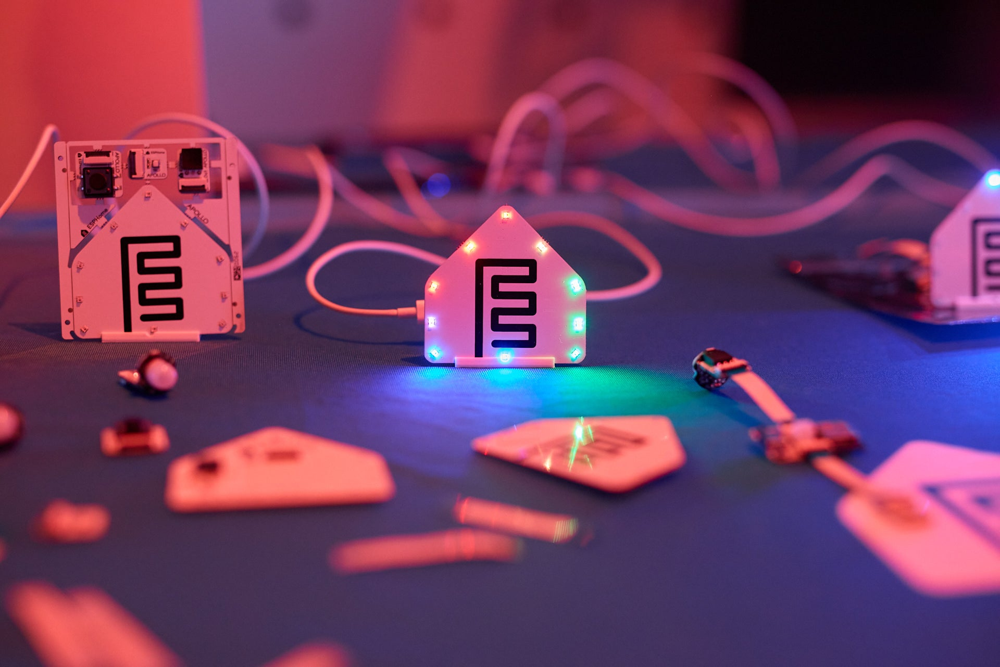

# ESPHome Starter Kit (ESK-1)

The ESK-1 is designed in collaboration with the **Open Home Foundation**. A portion of the profits from each ESK-1 sold goes directly to the OHF team to support their work on Home Assistant, ESPHome, Music Assistant, and other open-source smart home projects.

## Key Features

**ESP32-C6 Based:** Built on the ESP32-C6-mini module with Wi-Fi, Zigbee, and Thread radios for versatile smart home connectivity.

**Zigbee & Thread Support:** Dual antennas for Zigbee and Thread protocols. Supports Matter over Thread for future-proof smart home integration.

**USB-C Power:** USB-C port for easy power and programming.

**Expansion Ports:** Two 13-pin FPC cable ports allow you to connect and power virtually any sensor or accessory.

**Onboard Controls:** Boot and Reset buttons for easy flashing and debugging.

**Battery Powered:** Includes battery connector with MAX17048 fuel gauge for accurate voltage and percentage monitoring.

**Deep Sleep Support:** Configurable deep sleep duration for extended battery life. Wakes periodically to report sensor values and returns to sleep.

**Accessory Power Control:** GPIO-controlled power rail for connected accessories, automatically disabled during deep sleep to conserve battery.

## What's in the Kit

- **ESK-1 Main Board** - ESP32-C6 with dual FPC expansion ports
- **PIR Sensor** - Motion detection
- **Temperature/Humidity Sensor** - Environmental monitoring
- **Notification Puck** - LED and piezo buzzer PCB for visual and audio alerts
- **Button** - Physical input for triggering automations

## Pinout

| Function | GPIO |
|----------|------|
| I2C SCL | GPIO0 |
| I2C SDA | GPIO1 |
| Motion module input (PIR) | GPIO3 |
| Accessory power (FPC rail control) | GPIO4 |
| Onboard RGB LED (WS2812) | GPIO5 |
| Button module input | GPIO6 |
| LED & Buzzer module LEDs (WS2812) | GPIO14 |
| LED & Buzzer module buzzer | GPIO18 |
| Boot button | GPIO9 |

## ESPHome Integration

The ESK-1 is designed for use with ESPHome and Home Assistant. See the `Integrations/ESPHome/` folder for the YAML configuration.

## Hardware Files

3D models of the boards are in [`hardware/`](hardware/) for designing your own cases and mounts. Built something? See [CONTRIBUTING.md](CONTRIBUTING.md).

## Links

- **Product page:** [ESPHome Starter Kit on the Apollo shop](https://apolloautomation.com/products/esk-1-esphome-starter-kit)
- **Wiki (start here):** [ESPHome Starter Kit setup guide](https://wiki.apolloautomation.com/products/ESPHome-Starter-Kit/start-here/)
- **Forum:** [forum.apolloautomation.com](https://forum.apolloautomation.com/)
- **Discord** (support, feedback, discussion, future products): [dsc.gg/ApolloAutomation](http://dsc.gg/ApolloAutomation)
- **Open Home Foundation:** [openhomefoundation.org](https://www.openhomefoundation.org)
